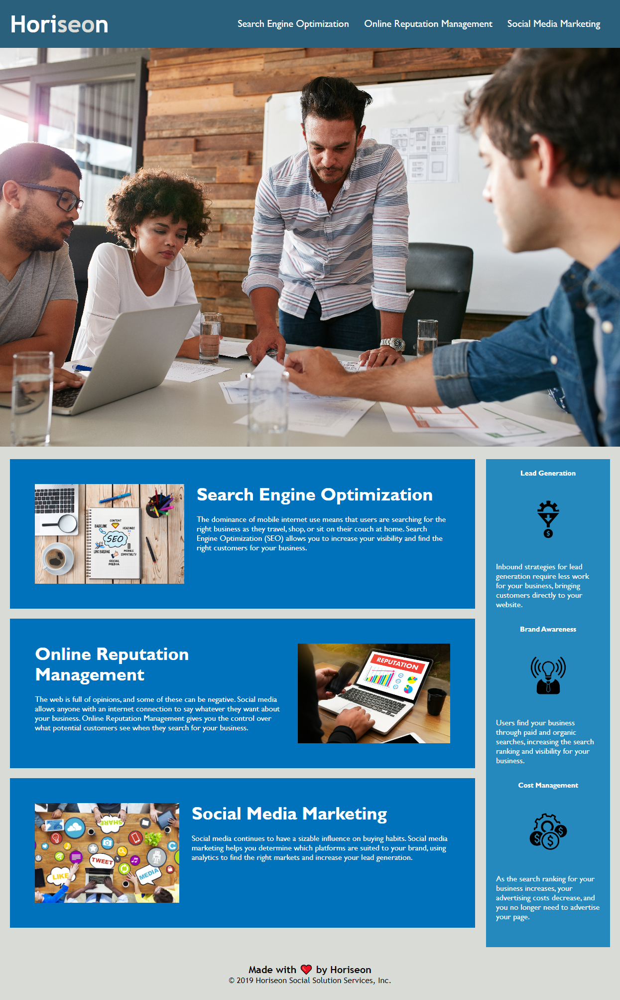

# Horiseon Accesibility Refactor

## Description

This refactor project is to update the Horiseon webpage to now be more accessible to clients by adding in semantic HTML elements, structuring the headers and elements in a logical order, adding alternative text to all images, and updating the title of the site to a unique name.

### Task Completed
 - HTML elements updated to be semantic
 - Redundant CSS classes were compressed and consolidated
 - Alternative text was added to all images
 - Headers and Elements were updated to be in sequential and logical order
 - Updated with a unique title

## Usage

Access the website here: [link here]

## Credits

Horiseon starter code was given from University of Texas.

## License

N/A